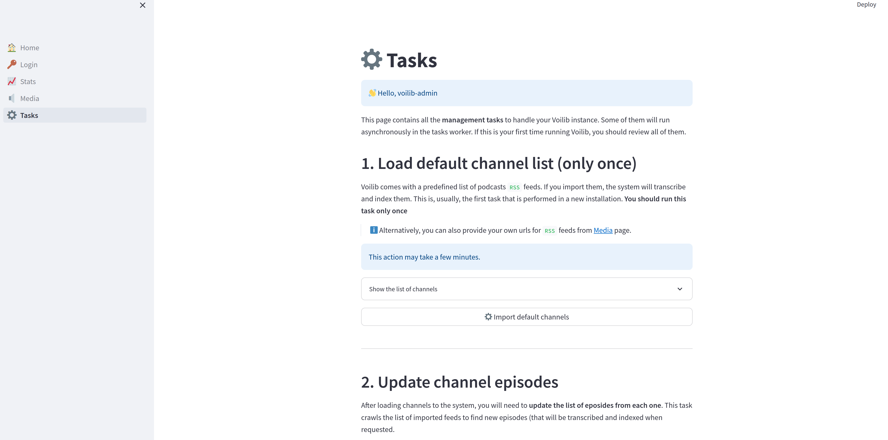

# Voilib: Open Source Podcast Search Engine 🔍

Voilib offers **semantic search** in thousands of minutes of
high-quality transcriptions of podcasts. Just type your query and it
will find related content in thousands of episodes. Voilib also allows
users to index their own audio files.


[](https://www.gnu.org/licenses/gpl-3.0)


## ▶️ Run your own instance now!

You can run **your own instance** of Voilib in your server, it
doesn't depend on any external paid service.

```
mkdir voilib && cd "voilib"
curl https://raw.githubusercontent.com/unmonoqueteclea/voilib/main/compose.yml -o compose.yml
docker compose up
```

You will need an admin user and password. By default user
`voilib-admin` with password `*audio*search*engine` will be created.

You can change default ports with environment variables:

- `VOILIB_MANAGEMENT_PORT` (for management page: default `8501`)
- `VOILIB_FRONTEND_PORT` (for frontend: default `80`)
- `VOILIB_API_PORT` (for backend: default `81`)

After all services are up, jump to
[http://localhost:8501](http://localhost:8501) and follow the
instructions in [Tasks page](http://localhost:8501/Tasks) to populate
Voilib with content. You can also check [first run tasks
section](./infra/readme.md#first-run-tasks).



More information about deployments in [infra/readme](./infra/readme.md).


## ❓ How it works
Voilib performs 4 main tasks: **collecting**, **transcribing**,
**indexing** and **querying** podcasts episodes to find the most
interesting fragments for every user prompt.

- **Collection**: Almost all public podcasts have an associated `RSS
  feed` that contains **metadata** about every episode and a link to
  the **audio file**. Voilib uses those feeds to **collect and store**
  that metadata from the list of podcasts configured by the
  application admin. Additionally, Voilib can also index your own
  audio files.

- **Transcription**: The collected episodes are then transcribed using
  [Whisper: Open AI's Open Source Transcription
  Model](https://openai.com/research/whisper).

- **Index**: Episodes transcripts are divided into **fragments of
  approximately 40 words** (check `DEFAULT_FRAGMENT_WORDS` constant to
  see the value currently used). Then, Voilib calculates the
  [embedding](https://en.wikipedia.org/wiki/Sentence_embedding) of
  each fragment. In that way, every fragment is converted into a
  vector of 384 floating point numbers (check `EMBEDDINGS_SIZE`
  constant to see the embedding size currently used). Those vectors
  are stored in a [vector database: Qdrant](https://qdrant.tech/).

- **Queries**: For each new user prompt, Voilib just needs to
  calculate the embedding of it and find the closest ones in the
  vector database, returning the most relevant episodes fragments to
  the user.

## License
Voilib is licensed under the GNU GPLv3 license. See [COPYING](./COPYING).

Permissions of this strong copyleft license are conditioned on making
available complete source code of licensed works and modifications,
which include larger works using a licensed work, under the same
license. Copyright and license notices must be preserved. Contributors
provide an express grant of patent rights.
